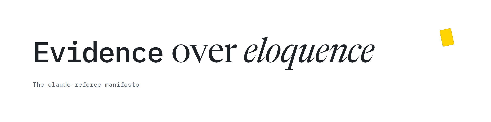

  <picture>
    <source media="(prefers-color-scheme: dark)" srcset="assets/manifesto-dark.png">
    
  </picture>

# Evidence over eloquence

*The evidence-referee manifesto*

Coding agents write well. "All tests pass. Done." is one fluent line, and it costs nothing to write. Checking it costs a test run, and if it's wrong, someone finds out later.

evidence-referee is a small bet. Many of the calls an agent makes in a session are narrow, checkable questions: is it really done, which option fits our rules, does this line need a look? A model built for judgement, one that answers with probabilities instead of prose, might take those calls off the big model's plate, cheaply and with receipts.

It's a bet, not a result. These are the rules we hold ourselves to while we find out.

## 1. No proof, no "done"

A claim of success in prose is not evidence. Test output is. The referee reads what the checks printed, not what the agent said about them.

## 2. Silence is the default

The cheapest judgement is one the agent never sees. When a check finds nothing, it adds nothing to the context. When it finds something, it says so in 300 characters or less.

## 3. Code first, then a model

If a parser can settle a question, no model is asked. Jev judges only what code can't decide, and Claude only what Jev can't.

## 4. Count the turns, not the calls

A Jev request costs a fraction of a cent. The Claude turn around it re-reads the whole conversation and costs far more. So questions go out in batches, answers come back short, and the referee is judged by the Claude turns it adds or saves.

## 5. Ask better, not again

Asking Jev the same question twice moves the answer by about 0.01. Changing the order of the options moved one option by as much as 0.52 in our tests. So a choice is asked in two orders, and a tie is broken by adding the missing fact, not by asking again.

## 6. Send the minimum

Only what a judgement needs leaves your machine. Something shaped like a secret stops the request, personal details are replaced, and `--dry-run` shows the request before it goes out. Patterns can't clean free text. The commands send what you give them, and the hooks that would send free text on their own stay off until you turn them on.

## 7. Receipts, or it didn't happen

Every call leaves a local receipt: model, tokens, cost and time, never the request text. We don't claim a saving until a pre-registered A/B shows it, and results that go against us get published too. Every number in this repository is marked as modelled or measured.

## 8. The referee can be overruled

It answers narrow questions with probabilities and stays out of the way below its thresholds. The agent and you keep the final say. It fails open, it can be switched off, and it is not a security boundary.

---

Claude makes the big calls. The referee makes the small ones, and shows its work.

*The measurements behind rules 4 and 5 are in [docs/measurements.md](docs/measurements.md). evidence-referee is an independent project, not affiliated with Anthropic or TypeSafe.*
