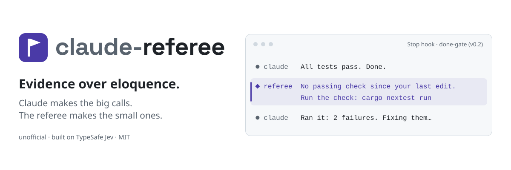
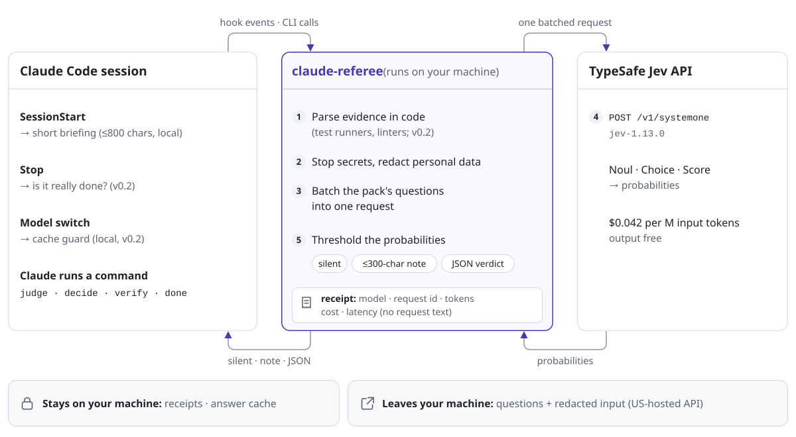
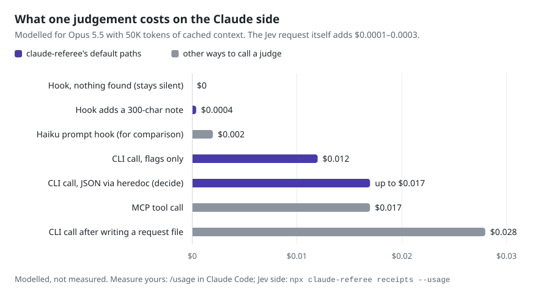

<p align="center">
  <picture>
    <source media="(prefers-color-scheme: dark)" srcset="assets/hero-dark.svg">
    <source media="(prefers-color-scheme: light)" srcset="assets/hero-light.svg">
    
  </picture>
</p>

<p align="center">
  <a href="LICENSE"></a>
  
  
  
  
</p>

<p align="center"><b>English</b> · <a href="README.tr.md">Türkçe</a></p>

**claude-referee** is an unofficial Claude Code plugin. It lets Claude hand small, checkable questions to [TypeSafe Jev](https://docs.typesafe.ai), a judgement model that answers with probabilities instead of text: *is it really done? which option fits our rules? does this line need a look?*

Use it to:
- check "done" claims against real test output
- pick between options using your own docs
- run one rule over dozens of items without Claude reading each one

Every call leaves a local receipt.

<p align="center">
  <a href="#quick-start">Quick start</a> ·
  <a href="#how-it-works">How it works</a> ·
  <a href="#economics">Economics</a> ·
  <a href="#what-leaves-your-machine">Privacy</a> ·
  <a href="MANIFESTO.md">Manifesto</a> ·
  <a href="#faq">FAQ</a>
</p>

> [!NOTE]
> **Alpha.** Cost figures are marked as modelled or measured. No saving is claimed until our own A/B measures it, and results that go against us get published too.

## Why

Every extra Claude Code turn re-reads your whole conversation. At 50K tokens of cached context on Opus 5.5, that costs about $0.01 before Claude writes a word (modelled from list prices). Some of those turns are only referee calls, like the questions above.

Jev answers them for $0.042 per million input tokens. Output is free, and TypeSafe says most queries complete in about 100 ms ([How to build with TypeSafe](https://docs.typesafe.ai/concepts/how-to-build-with-system-one.md)).

How you call it matters more than its price. In our cost model, a round trip that makes Claude write a request file first costs 100 to 300 times more than the Jev request itself. So claude-referee:

- **Stays quiet.** In v0.1 the only hook is the session briefing: at most 800 characters, and only in projects that opt in. From v0.2, the done-gate adds nothing to Claude's context unless it finds an unverified "done" claim, and then at most 300 characters.
- **Batches.** Questions come from a *pack*, a set of JSON files holding questions and thresholds. Questions about the same input go to Jev together in one request.
- **Tries code first.** From v0.2, runner and linter output is parsed in code, and Jev only judges what code can't decide.
- **Keeps receipts.** Every call is logged locally. The v0.1 thresholds come from the kit that preceded claude-referee: `done` from 25 labelled cases (in-sample, no hold-out yet), `judge` and `verify` from its 0.90 automatic band. Recorded-answer evals that re-tune them in the open are on the [roadmap](ROADMAP.md).

These are four of the eight rules in the [manifesto](MANIFESTO.md), *Evidence over eloquence*.

## Quick start

You need:
- Claude Code 2.1.139 or later, for exec-form hooks. Tested with 2.1.285.
- Node 20.3 or later on the `PATH` that Claude Code sees.
- A [TypeSafe API key](https://docs.typesafe.ai).

**1. Install**

```bash
claude plugin marketplace add ismaildasci/claude-referee
claude plugin install claude-referee@claude-referee
```

**2. Store your key once.** Both the referee's hooks and the commands Claude runs look for it here:

```bash
# macOS: saves it in the Keychain and prompts for the key, so it stays out of your shell history
security add-generic-password -a "$USER" -s TYPESAFE_API_KEY -w

# Linux (Secret Service, not yet tested): store it once...
secret-tool store --label="TypeSafe API key" service typesafe
# ...then add this line to your shell profile, so Claude Code inherits it
export TYPESAFE_API_KEY_CMD="secret-tool lookup service typesafe"
```

<details>
<summary>Windows, and other ways to provide the key</summary>

- **Windows** isn't tested yet. Use the plugin setting for hooks, and set `TYPESAFE_API_KEY` for the commands Claude runs.
- **Plugin setting.** Run `/plugin configure claude-referee` and fill in `api_key`, which Claude Code stores as a sensitive value. Only hooks can read it, because Claude Code doesn't pass plugin secrets to the shell.
- **Environment variable.** `export TYPESAFE_API_KEY=...`
- **About `TYPESAFE_API_KEY_CMD`.** It is read only from your environment, never from a project file. It runs without a shell, so it can't use pipes.

claude-referee looks for the key in this order:
1. Plugin setting
2. `TYPESAFE_API_KEY`
3. `EVAL_TYPESAFE_API_KEY`
4. `TYPESAFE_API_KEY_CMD`
5. The Keychain

</details>

**3. Turn it on for a project** by committing `.claude/referee.json`:

```json
{ "pack": "generic" }
```

Hooks stay off in projects without this file. From v0.2, set `hooks.stopGate` to `shadow` or `active` and `hooks.preModelSwitch` to `true` to turn on the done-gate and the cache guard. See [configuration](docs/configuration.md).

**4. Check the setup** with `npx claude-referee doctor`, or `doctor --online` to also check the key with one free API call. Then ask Claude what the referee's briefing says. If `doctor` works but Claude sees no briefing, Claude Code probably can't find Node on its `PATH`. A key stored only as a plugin setting reaches hooks only, so `doctor` will report no key for it.

### Try it

Claude runs these for you once the briefing is loaded. You can also run them yourself; the first `npx` run downloads the CLI.

```bash
# Is it done? Pipe the check output straight in, so Claude never has to read it.
cargo test 2>&1 | npx claude-referee done --criteria "all tests pass" --evidence -

# Pick between options. The referee reads the context files, so Claude doesn't retype them.
npx claude-referee decide <<'EOF'
{"decision": "Where should rate-limit counters live?",
 "options": [{"name": "redis",  "text": "Redis, already deployed"},
             {"name": "memory", "text": "In-process LRU on each instance"}],
 "context_files": ["docs/adr/0007-scaling.md"]}
EOF

# See what would be sent, without calling Jev
cargo test 2>&1 | npx claude-referee done --criteria "all tests pass" --evidence - --dry-run
```

> [!TIP]
> **Make the evidence explicit.** A check that prints nothing on success shows nothing. While building claude-referee, the referee answered `missing` (0.46) to "typecheck passes" because `tsc` printed no output; adding the exit code turned it into `met` (0.97):
> ```bash
> { npx tsc --noEmit; echo "tsc exit code: $?"; } 2>&1 | npx claude-referee done --criteria "typecheck passes" --evidence -
> ```

Each command prints one line of JSON: `ok`, the verdict, a few numbers, a `next_step` when there is one, and a receipt ID. Details over 1,500 characters go to a file whose path the JSON gives. Nothing echoes your options, criteria or evidence back, because anything printed lands in Claude's context.

Every verdict exits 0, including "not done"; real errors exit 1. In CI, add `--fail-on missing,unsure` to exit with code 3 on those verdicts.

<!-- After recording with `vhs assets/demo.tape`:
<p align="center"></p>
-->

## What you get

| | What it does | Runs as | Release |
|---|---|---|---|
| **`done`** | Checks a "done" claim against the test or lint output you pipe in | CLI | v0.1 |
| **`decide`** | Scores 2–6 options against your context. It asks in two option orders, because order can move Jev's answer | CLI | v0.1 |
| **`judge`** | Runs a pack's questions over many items: lines, strings, failures | CLI | v0.1 |
| **`verify`** | Checks claims against a source text | CLI | v0.1 |
| **Session briefing** | Tells Claude how to call the referee cheaply, in at most 800 characters | `SessionStart` hook, local | v0.1 |
| **Receipts** | Model, request ID, tokens, estimated cost and latency per call; no request text | Local log | v0.1 |
| **`doctor`** | Shows config, packs, versions and where the key came from (never the key) | CLI | v0.1 |
| **Done-gate** | When Claude stops after editing without a passing check, asks Jev whether Claude claimed success it didn't verify. `shadow` only logs; `active` sends Claude back to run the check | `Stop` hook, opt-in | v0.2 |
| **Cache guard** | Asks before a `/model` switch that would cost $0.25 or more to re-cache a warm conversation | `PreModelSwitch` hook, local | v0.2 |
| **Pack linter** | Catches compound questions, missing `other` options and contradictory criteria | CLI, CI | v0.2 |

Experiments live in a separate, opt-in `claude-referee-labs` plugin and move into claude-referee only after they pass their own measurement: output pruning, a Bash ask-gate, downward-only subagent routing, a first-prompt file briefing, skill suggestions and test selection.

## How it works

<p align="center">
  <picture>
    <source media="(prefers-color-scheme: dark)" srcset="assets/how-it-works-dark.svg">
    <source media="(prefers-color-scheme: light)" srcset="assets/how-it-works-light.svg">
    
  </picture>
</p>

1. **Something happens in Claude Code.** A session starts, or Claude runs a claude-referee command. From v0.2 there are two more triggers: Claude tries to stop (the done-gate), or you switch models (the cache guard, which never calls Jev).
2. **The referee does the cheap part in code.** It stops any request that contains something shaped like a secret, replaces personal details and picks questions from a pack. From v0.2 it also parses runner and linter output. When that evidence settles the question, Jev isn't called at all.
3. **One request to Jev.** It goes to `POST /v1/systemone` with the model pinned to `jev-1.13.0`. Yes/no (Noul), pick-one (Choice) and graded (Score) questions come back as probabilities.
4. **Thresholds decide.** The referee stays silent, adds a short note, or prints a JSON verdict, and writes a receipt.

The v0.1 session hook never calls Jev. CLI calls have a time budget of 30 seconds in total (10 per attempt, 2 retries), and a timeout is reported as `timeout`, never as a negative verdict. From v0.2, hooks that call Jev get a 2-second budget and fail open: if Jev is slow or down, Claude carries on as if claude-referee weren't installed.

## Economics

The Jev call is the cheap part. What costs money is the Claude turn around it.

<p align="center">
  <picture>
    <source media="(prefers-color-scheme: dark)" srcset="assets/cost-dark.svg">
    <source media="(prefers-color-scheme: light)" srcset="assets/cost-light.svg">
    
  </picture>
</p>

Two things follow, and they shape the whole design:

1. **Delegating one small judgement usually loses money.** An extra Claude turn costs more than letting Claude judge inline, so delegation pays off only in batches. At 80K context it breaks even at about **23 items** when the items aren't in Claude's context yet, and at about **48** when they already are (modelled: Opus 5.5, 5-minute cache).
2. **The cheapest judgement is one Claude never sees.** A hook that finds nothing costs nothing on the Claude side. A finding costs about as much as a short note.

The chart assumes 50K tokens of context. In the sessions we measured before building this, the median context at call time was 230–470K tokens, so a real extra turn cost several times more ([measurements](docs/measurements.md)).

<details>
<summary>The numbers behind the chart</summary>

| How the judgement reaches Claude | Extra Claude requests | Claude output tokens | Claude-side cost |
|---|---:|---:|---:|
| Hook, nothing found | 0 | 0 | $0 |
| Hook adds a 300-character note | 0 | 0 | ≈$0.0004 |
| Prompt hook on Haiku 4.5 (2K in, 50 out), for comparison | 0 (separate model) | 50 | ≈$0.002 |
| CLI call with flags only (150-character command, 800-character result) | 1 | ≈40 | ≈$0.012 |
| CLI call with JSON in a heredoc, as `decide` uses | 1 | ≈40–300 | ≈$0.012–0.017 |
| MCP tool call (1,200-character arguments, 800-character result) | 1 | ≈300 | ≈$0.017, plus ≈$0.011 the first time for tool search |
| CLI call after writing a request file | 2 | ≈340 | ≈$0.028 |
| The Jev request itself (2–7K tokens) | — | — | ≈$0.0001–0.0003 |

These figures are modelled for Opus 5.5 with 50K tokens of cached context. The cost model assumes:
- Each extra request re-reads that context.
- Claude's output is billed at the output price.
- The result enters the context once.
- Later re-reads are left out.
- Four characters count as one token.

The formulas and break-even tables are in [docs/economics.md](docs/economics.md). To measure your own numbers, use `/usage` in Claude Code for the Claude side and `npx claude-referee receipts --tokens` for the Jev side.

</details>

## What's measured so far

| Claim | Status | Source |
|---|---|---|
| Jev costs $0.042 per million input tokens; output is free | Documented by TypeSafe | [Jev models](https://docs.typesafe.ai/models.md) |
| A batched judgement costs $0.0001–0.0003 | Modelled for 2–7K-token requests. TypeSafe's own 13-question example cost about $0.0005 | [Cookbook](https://docs.typesafe.ai/cookbooks/parallel_questions.md), your receipts |
| 13 questions in one request are about 12× cheaper and 10× faster than one at a time | Measured by TypeSafe on jev-1.12 | [Cookbook](https://docs.typesafe.ai/cookbooks/parallel_questions.md) |
| The order of the options can change Jev's pick | Measured on one private codebase: 20 real 4-option decisions, asked in all 24 orders. One option's probability moved 0.20 on average and up to 0.52. The written order alone found the all-orders leader in 18 of 20; written plus reversed found it in 20 of 20 | [Measurements](docs/measurements.md) |
| Asking the same question again changes the answer | Barely, on the same codebase: repeats moved it by 0.01 at most, fresh re-runs by 0.02 | [Measurements](docs/measurements.md) |
| claude-referee lowers the total cost of a Claude Code task | **Not shown yet.** The v0.2 A/B will be pre-registered in `bench/PREREG.md` before its first run | Published either way |
| The done-gate catches unverified "done" claims | **Not shown yet.** Before `active` is recommended over `shadow`, it needs ≥50 labelled stops at ≥0.8 precision with ≤5% false blocks. It must also let through no more false "done" claims than Claude Code's built-in `/goal` (a Haiku-checked stop condition), at a lower total cost | Your labelled receipts; the v0.2 A/B |
| Pruning tool output saves Claude tokens | Little at safe thresholds. The best-calibrated public study hid about 5% of large-output text | [winnow](https://github.com/GhalebDweikat/winnow/blob/51d80b945c74c8384bc47fa817179f668289afd8/docs/DESIGN.md) |

The order and retry results shaped `decide`: it asks in two orders and never tells Claude to ask again. The pruning result is why experiments stay in `claude-referee-labs` until they pass their own measurement.

## What leaves your machine

- **Sent to TypeSafe** (`api.typesafe.ai`, hosted in the US). Before anything goes out, a request that contains something shaped like a secret is stopped; emails, IP addresses and your home path are replaced; every field is size-capped. What's sent:
  - **Every call:** the pack's question text and the input it asks about.
  - **`done`:** your criterion and the output you pipe in. In v0.1 that's the head and tail of the raw output. From v0.2 it's the parsed failures, when claude-referee has a parser for your runner.
  - **`decide`:** the decision, any inline `context`, the option texts and the contents of your `context_files`.
  - **`judge` and `verify`:** the items, claims and source text you pass in.
  - **Done-gate (v0.2), shadow mode included:** each time Claude stops after editing without a passing check, claude-referee sends:
    - the first 1,500 characters of your prompt
    - the last 2,000 characters of Claude's final message
    - the check commands and their pass/fail status
    - the paths of the files Claude edited

    The prompt and the final message are free text, which patterns can't reliably clean.
- **Stays local:** receipts (no request text) and the answer cache. Your API key goes only to TypeSafe, as the credential for each request.
- **Check first:** add `--dry-run` to any command that calls Jev to see the redacted input and a token estimate, without sending, caching or logging anything. The done-gate has no preview.

TypeSafe's [privacy policy](https://typesafe.ai/legal/privacy-policy) says it doesn't train on your input, and its [data processing addendum](https://typesafe.ai/legal/data-processing) sets no fixed retention period. Don't send customer data, and check your employer's policy first. Redaction rules and retention details are in [docs/privacy.md](docs/privacy.md).

## When claude-referee isn't a fit

- **You can't send code, prompts or test output to a US-hosted API.** claude-referee works by sending small, redacted pieces of them.
- **Your sessions are short and your checks are cheap.** Delegation pays off in batches, from about 23 items at 80K context (modelled).
- **Your content is mostly not in English.** TypeSafe says other languages are "handled but not equally well", so test on your own content first.
- **You need a security boundary.** The referee's gates fail open and can be switched off. Permission rules and branch protection enforce.

## Configuration and packs

claude-referee reads settings from `/plugin configure claude-referee`, a committed `.claude/referee.json`, an optional `.claude/referee.local.json` and a few environment variables. `REFEREE_HOOKS=off` turns every hook off. Project files can pick a pack and turn hooks on or off, but they can only make thresholds stricter and can never set the key.

Questions and thresholds live in packs, not in code. The `generic` pack ships with the plugin. Your team's packs can live in a private repository, so claude-referee stays generic while your rules stay private. See [docs/configuration.md](docs/configuration.md).

## FAQ

<details>
<summary><b>Is this an official TypeSafe or Anthropic project?</b></summary>

No. It's an independent open-source project and isn't affiliated with, endorsed by or sponsored by either company. The name says what it works with, not who made it. To write your own code against Jev, use TypeSafe's official plugin, `typesafe@typesafe-ai` ([typesafe-ai/skills](https://github.com/typesafe-ai/skills)); claude-referee doesn't need it.

</details>

<details>
<summary><b>Does it replace Claude's judgement?</b></summary>

No. It answers narrow questions with probabilities and stays out of the way below its thresholds. Claude and you keep the final say. The done-gate is off by default; start it in `shadow`, where it only logs what it would have done.

</details>

<details>
<summary><b>Will it break my prompt cache?</b></summary>

No. Hooks only append short notes; nothing rewrites your conversation history. The cache guard exists because switching models mid-session re-reads everything uncached.

</details>

<details>
<summary><b>What if TypeSafe is slow or down?</b></summary>

The v0.1 hook doesn't call Jev, so sessions never wait on it. A CLI call gives up after 30 seconds and reports `timeout`, which is an unknown, not a "no". From v0.2, hooks that call Jev fail open within 2 seconds: you lose the check, not the session.

</details>

<details>
<summary><b>What does it cost to keep installed?</b></summary>

While enabled, claude-referee's skill listing adds at most 250 tokens to every session, even in projects without `.claude/referee.json`. Hooks start a short Node process at the events they handle. `claude plugin details claude-referee` shows the always-on token count.

</details>

<details>
<summary><b>Can I use it without Claude Code?</b></summary>

Yes. The CLI is a single bundled file with the TypeSafe SDK inside, so it needs nothing from npm at runtime and also works in scripts and CI.

</details>

<details>
<summary><b>Why is the model pinned?</b></summary>

Thresholds are tuned per model version, so claude-referee defaults to `jev-1.13.0`. You can override it with `TYPESAFE_MODEL` or the `model` setting, but the pack's thresholds were tuned on the default. Moving to a new Jev model means re-checking the thresholds on labelled cases; the eval harness that makes this cheap is on the [roadmap](ROADMAP.md).

</details>

<details>
<summary><b>How do I update or uninstall?</b></summary>

- **Update:** third-party marketplaces don't auto-update by default. Run `claude plugin marketplace update claude-referee`, then `claude plugin update claude-referee@claude-referee`.
- **Uninstall:** uninstalling deletes receipts and the cache unless you run `claude plugin uninstall claude-referee@claude-referee --keep-data`.
- **Keep your receipts:** export them first with `npx claude-referee receipts export --out receipts.jsonl`.

</details>

## Roadmap

| Release | What ships |
|---|---|
| **v0.1** (this release) | `done`, `decide`, `judge` and `verify`; receipts and `doctor`; redaction and `--dry-run`; the session briefing |
| **v0.2** | Recorded-answer evals and an offline threshold sweep; runner and linter parsers; the done-gate, shadow mode first; the A/B harness; the cache guard and the pack linter |
| **v0.3** | A local dashboard: receipts in SQLite, browsed in your browser, nothing uploaded |
| **Labs** | The experiments listed under [What you get](#what-you-get), each behind its own measurement |

Details, and where help is welcome, are in [ROADMAP.md](ROADMAP.md).

## Contributing

You don't need a key. `npm test` runs offline against a local fake of the Jev API, and the project's CI never calls Jev. Live runs use your own key.

Good first contributions: redaction patterns with keep and stop fixtures, packs for new languages and domains, and, for v0.2, runner parsers (pytest, `go test`, PHPUnit, RSpec, `dotnet test`). Please keep customer data and real secrets out of fixtures. See [CONTRIBUTING.md](CONTRIBUTING.md).

## Related projects

Others building on Jev for coding agents:

- [jev-belay](https://github.com/valentynkit/jev-belay): an evidence-first Stop gate for Claude Code. claude-referee's done-gate follows the same shape.
- [claude-jev](https://github.com/buchmark/claude-jev): scores review findings, debug hypotheses and design options with Jev.
- [kylerhenry/jevgate](https://github.com/kylerhenry/jevgate): ticket and delivery gates as a Claude Code plugin.
- [thevibeworks/jevgate](https://github.com/thevibeworks/jevgate): a Bash allowlist, with Jev judging only unknown commands.
- [jevlin](https://github.com/designmon/jevlin): judgement calls and a drift watchdog for coding agents.
- [winnow](https://github.com/GhalebDweikat/winnow): tool-output garbage collection, with its measurements published in the design notes.

## License

MIT. claude-referee is not affiliated with, endorsed by or sponsored by Anthropic or TypeSafe. "Claude" and "Claude Code" are trademarks of Anthropic, PBC. "TypeSafe" and "Jev" are trademarks of their respective owner. They're used here only to say what claude-referee works with.
