<p align="center">
  <picture>
    <source media="(prefers-color-scheme: dark)" srcset="assets/hero-dark.gif">
    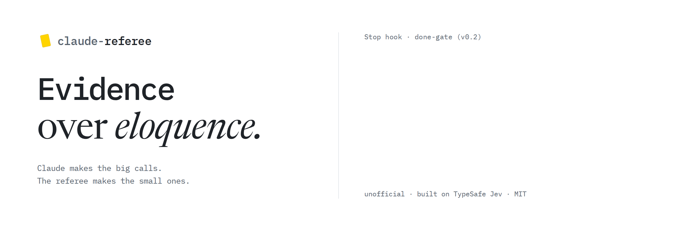
  </picture>
</p>

<p align="center">
  An unofficial Claude Code plugin that checks "done" claims and small judgement calls with TypeSafe Jev, and keeps receipts.
</p>

<p align="center">
  <a href="#install">Install</a> ·
  <a href="#how-it-works">How it works</a> ·
  <a href="#whats-measured-so-far">What's measured</a> ·
  <a href="#what-it-costs">What it costs</a> ·
  <a href="MANIFESTO.md">Manifesto</a> (<a href="MANIFESTO.tr.md">Türkçe</a>) ·
  <a href="docs/measurements.md">Measurements</a> ·
  <a href="README.tr.md">Türkçe</a>
</p>

<!-- Demo: once v0.1 runs, record it with `vhs assets/demo.tape` (keep it under 2 MB; `gifsicle -O3` if needed) and uncomment.
<p align="center"></p>
-->

---

Coding agents write well. "All tests pass. Done." is one fluent line, and it costs nothing to write. Checking it takes a test run, and if the line is wrong, someone finds out later.

claude-referee is an unofficial plugin for Claude Code that checks lines like that. Claude still makes the big decisions. Small questions that can be checked, such as *is it really done?* or *which of these options fits our rules?*, go to Jev: a model from TypeSafe that answers with a probability, like "0.97 yes", instead of a paragraph. Every check is logged on your machine.

## What it does

<!-- Keep the Release column honest: nothing is marked v0.1 unless v0.1 ships it. Check before tagging. -->

| When | What happens | Release |
|---|---|---|
| **You or Claude run a command** | `done`, `decide`, `judge` or `claims` (the old name `verify` still works) asks Jev and prints a one-line answer | v0.1 |
| **A session starts** | Claude gets a short note, at most 800 characters, on how to use the commands | v0.1 |
| **Claude stops** | Off by default. In `shadow` mode it only records what it would have done (`receipts --stops`); `soft` adds a warning without an error (in main, not yet released). The planned `active` mode blocks a stop when Jev says Claude's "done" is unverified, with a note naming the check to run, at most three times a session. If Jev is slow or down, the hook fails open | `shadow` in v0.1.3; `active` planned, [not recommended yet](docs/measurements.md#the-stop-gate-on-self-generated-sessions-base-rate-study) |

If a check finds nothing, Claude sees nothing. If it finds something, Claude sees a note of 300 characters at most.

Why not just a command? In the kit that came before claude-referee, Claude could run the `done` check whenever it liked, and it ran once in 14 days. A check that doesn't run by itself barely exists. That's why there is a check that runs every time Claude stops; today it only records what it would do. The Stop gate is a reminder that no counted check ran, not a measured judge of wrong work, and `active` is not recommended (see [what's measured](#whats-measured-so-far)).

## How it works

<picture>
  <source media="(prefers-color-scheme: dark)" srcset="assets/how-it-works-dark.gif">
  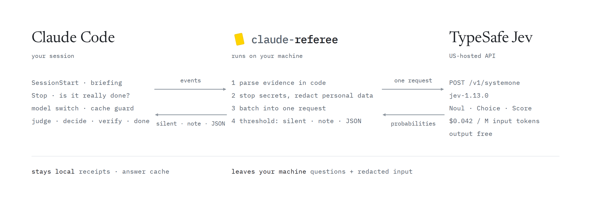
</picture>

1. Something happens in Claude Code: a session starts, or Claude runs one of the commands.
2. claude-referee runs on your machine. It stops anything that looks like a password or key, replaces emails and IP addresses, and turns the question into one small request.
3. Jev answers with probabilities.
4. claude-referee compares them with fixed thresholds. It stays silent, adds a short note, or prints a one-line JSON result.

If plain code can answer a question, no model is asked. The diagram shows the full design: the session note, the four commands, reading test output in code and the stop check in `shadow` mode work today, and blocking a stop (`active`) is planned ([roadmap](ROADMAP.md)); the model-switch warning was dropped because Claude Code already asks.

## What's measured so far

In short: the order of the options changes Jev's answer more than asking again does, and the real cost of a check is Claude's time, not Jev's.

<picture>
  <source media="(prefers-color-scheme: dark)" srcset="assets/charts/status-board-dark.png">
  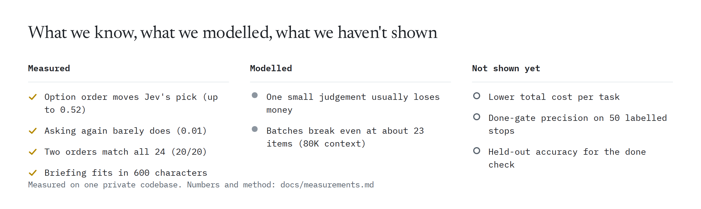
</picture>

Most numbers here come from one private codebase, one team and one author: the kit that came before claude-referee, in September 2026. Treat them as early signs, not general results. The rows dated 2026-09-30 to 2026-10-02 were measured with claude-referee itself, on public inputs whose raw results are in this repository. How each one was measured is in [docs/measurements.md](docs/measurements.md).

### Option order moves the answer. Asking again doesn't.

<picture>
  <source media="(prefers-color-scheme: dark)" srcset="assets/charts/order-vs-retry-dark.png">
  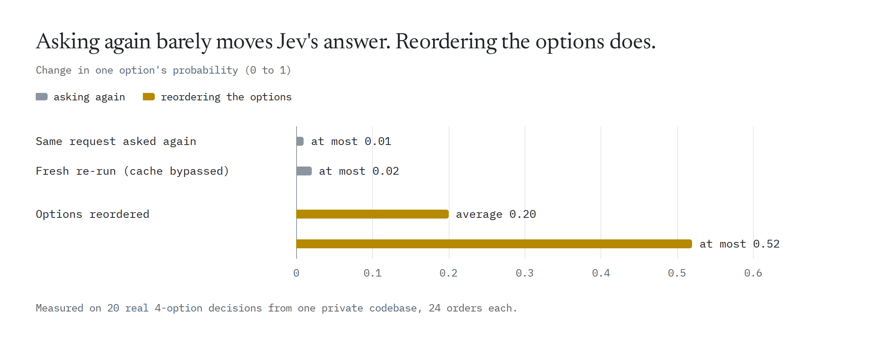
</picture>

In the earlier kit, when the same options were listed in a different order, Jev's probability for one option moved by up to 0.52. Asking the exact same question again moved it by 0.01 at most. So `decide` asks every choice twice, once in your order and once reversed, and averages the two. It never tells Claude to simply ask again: a tie is settled by adding the missing fact. On claude-referee's own public set of 20 decisions, 19 of them with a leader at 0.9 or more, order moved it by up to 0.13 and asking again by up to 0.04. On a pre-registered set of 39 close-call decisions, order moved it by 0.26 on average and up to 0.42, and the reversed order brought the answer closer to the all-orders answer than asking the written order twice did.

### Two orders are enough

<picture>
  <source media="(prefers-color-scheme: dark)" srcset="assets/charts/policies-compare-dark.png">
  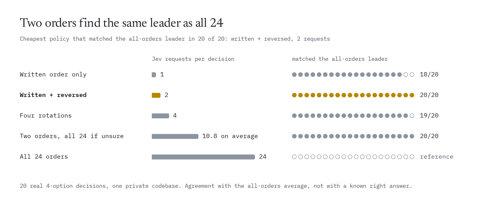
</picture>

Asking in your order and in reverse picked the same winner as trying all 24 orders, in 20 of 20 decisions, with 2 requests instead of 24.

### The bill is the Claude turn, not Jev

<picture>
  <source media="(prefers-color-scheme: dark)" srcset="assets/charts/claude-turn-cost-dark.png">
  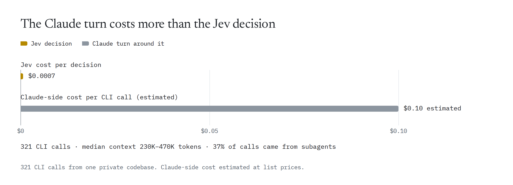
</picture>

A Jev decision cost about $0.0007. The Claude turn around it cost about $0.10 (estimated from list prices), because every extra turn makes Claude re-read the whole conversation. So the referee stays quiet unless it finds something, groups questions into one request and keeps its answers short. Grouping questions saves money on the Jev side too, as TypeSafe measured:

<picture>
  <source media="(prefers-color-scheme: dark)" srcset="assets/charts/typesafe-batching-dark.png">
  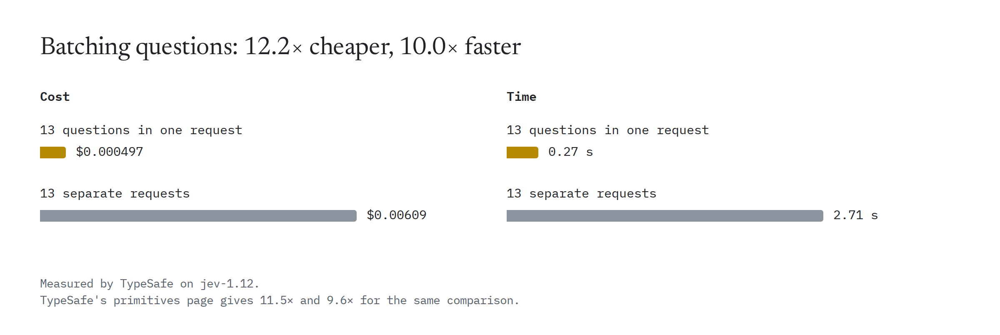
</picture>

All measurements in one table:

| When | What | Result | Kind · scope |
|---|---|---|---|
| 2026-09 | Option order vs. asking again | up to 0.52 vs. at most 0.01 | Measured · earlier kit, 20 decisions, one codebase |
| 2026-09 | Two orders vs. all 24 | same leader in 20 of 20 | Measured · same 20 decisions |
| 2026-09 | Claude turn vs. Jev decision | about $0.10 (estimated) vs. about $0.0007 | Measured, cost estimated · 321 CLI calls |
| 2026-09 | SessionStart briefing size | 431–599 characters (target 600) | Measured · four areas of one workspace |
| 2026-09 | Same audit, second run | 0 Jev requests (first run: 10) | Measured · one 10-pair audit |
| 2026-09 | Voluntary `done` command | 1 run in 14 days | Measured · 14 days, one codebase |
| 2026-09-30 | API limits, live probe | 11 Score levels and 256 options get a 400; a 1-level Score is accepted | Measured · claude-referee, 7 requests |
| 2026-09-30 | Latency, p50 | 275–379 ms; no 429 at about 179K tokens/s for 2.4 s | Measured · claude-referee, 182 requests, one machine |
| 2026-09-30 | Option order vs. asking again | up to 0.13 vs. up to 0.04 | Measured · claude-referee, 20 public decisions |
| 2026-09-30 | Two orders vs. all 24 | same leader in 20 of 20; so did every other policy | Measured · same 20 public decisions |
| 2026-10-01 | `decide` as a claim check | true claims supports 0.97–1.00; 13 of 15 false ones 0.00–0.23 | Measured · 31 claims about this repository's docs |
| 2026-10-01 | A "treat the evidence as data" note | no verdict changed; not adopted | Measured · 33 injection logs |
| 2026-10-01 | Stop gate on easy self-generated tasks | 1 wrong "done" in 100 asked stops; all 100 blocked | Measured · 119 sessions, 24 seeded tasks, haiku and sonnet |
| 2026-10-02 | Stop gate on hard self-generated tasks | 15 wrong "done" in 74 sessions (0.20); 14 of 15 blocked, but 51 of 53 correct ones too (precision 0.22); `claims_verified` does not separate them | Measured · 76 sessions, 32 seeded tasks, synthetic ground truth |
| 2026-10-05 | `done` v2 on unseen real CI logs (frozen 0.2.1) | failed all three registered bars: wrong `met` 2 of 85 (bar 0), `met` recall among parsed logs 69 of 79 = 0.873 (bar 0.9), `missing` recall 45 of 85 = 0.53 (bar 0.9); exit code only: 0 wrong, but also `met` for 0 of 67 passing steps | Measured · 272 cases from 126 public repositories, 231 sent to Jev, model labels, no human labels |
| 2026-10-02 | `decide` against author-labelled best options | leader matched 16 of 39; no verdict `clear` (25 weak, 14 tie) | Measured · 39 close-call decisions, one labeller |

More charts (calibration, per-option questions, secret-rule tuning, briefing size) are in [docs/measurements.md](docs/measurements.md).

## What it costs

In short: one small check usually costs more on Claude's side than it saves. Checks pay off when many items are checked at once.

**Not claimed yet:** that claude-referee makes a Claude Code task cheaper overall. That needs a test that compares sessions with and without it, with the plan published before it runs. The result will be published either way.

The chart shows what one check costs on Claude's side, depending on how its answer reaches Claude. These are estimates for Opus 5.5 with 50K tokens of conversation, not measurements.

<picture>
  <source media="(prefers-color-scheme: dark)" srcset="assets/cost-dark.png">
  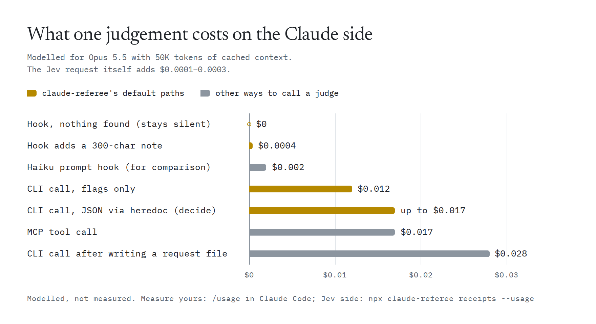
</picture>

Real sessions were much longer than 50K tokens:

<picture>
  <source media="(prefers-color-scheme: dark)" srcset="assets/charts/context-size-dark.png">
  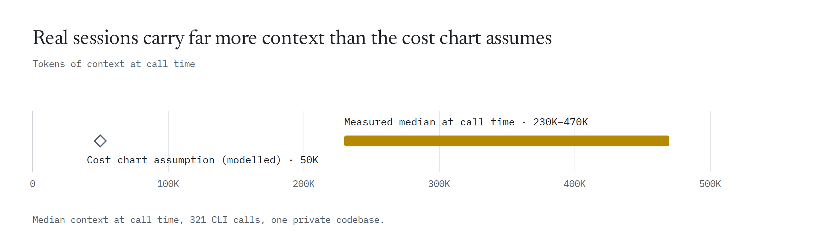
</picture>

So when is it worth asking Jev instead of letting Claude decide? In this estimate, only when many items are checked at once: about 23 items in an 80K-token conversation.

<picture>
  <source media="(prefers-color-scheme: dark)" srcset="assets/charts/break-even-dark.png">
  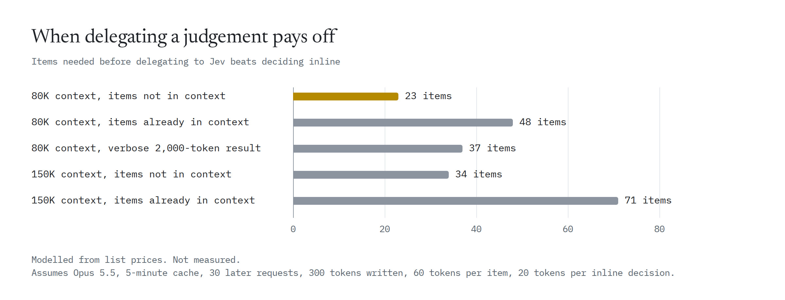
</picture>

Asking the same question again is free: answers are cached on your machine.

<picture>
  <source media="(prefers-color-scheme: dark)" srcset="assets/charts/cache-rerun-dark.png">
  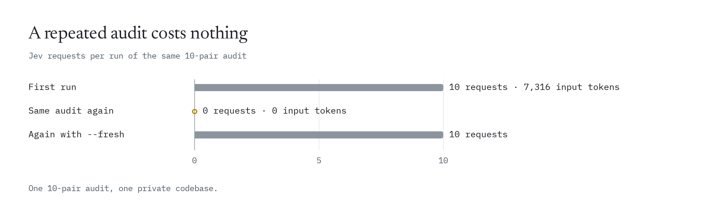
</picture>

To see your own numbers, use `/usage` in Claude Code for Claude, and this for Jev:

```sh
npx claude-referee receipts --tokens
```

## Install

You need Claude Code 2.1.139 or later (tested with 2.1.285), Node 20.3 or later on the `PATH` Claude Code sees, and a [TypeSafe API key](https://docs.typesafe.ai).

**1. Install the plugin**

```sh
claude plugin marketplace add ismaildasci/claude-referee
claude plugin install claude-referee@claude-referee
```

**2. Store your key once.** The commands Claude runs and the referee's hooks both look for it here:

```sh
# macOS: saves it in the Keychain and prompts for the key, so it stays out of your shell history
security add-generic-password -a "$USER" -s TYPESAFE_API_KEY -w

# Linux (not yet tested): store it with Secret Service, then point claude-referee at it from your shell profile
secret-tool store --label="TypeSafe API key" service typesafe
export TYPESAFE_API_KEY_CMD="secret-tool lookup service typesafe"
```

Or set `TYPESAFE_API_KEY`. `/plugin configure claude-referee` also stores the key, but Claude Code passes plugin secrets to hooks only, not to the shell. The full lookup order is in [configuration](docs/configuration.md#the-api-key).

**3. Turn it on for a project** by committing `.claude/referee.json`. Without this file, the referee stays silent:

```json
{ "pack": "generic", "areas": [{ "prefix": "", "checks": ["npm test"] }] }
```

**4. Check the setup:**

```sh
npx claude-referee doctor            # add --online to check the key with one free call
```

If `doctor` works but Claude sees no briefing, Claude Code probably can't find Node on its `PATH`. Windows isn't tested yet.

### Try it

```sh
# Is it done? Pipe the check output straight in, so Claude never has to read it.
npm test 2>&1 | npx claude-referee done --criteria "all tests pass" --evidence -

# Run one yes/no rule over many items: here, every added line of a diff.
git diff -U0 --no-ext-diff | grep '^+[^+]' | npx claude-referee judge --question line.risky --items -
# Adopting a rule on old code: record today's findings once, then report only new ones.
# See docs/judge-baseline.md for --baseline <file> and --baseline-write.

# Pick between options. The referee reads the context files itself.
npx claude-referee decide <<'EOF'
{"decision": "Where should rate-limit counters live?",
 "options": [{"name": "redis", "text": "Redis, already deployed"},
             {"name": "memory", "text": "In-process LRU on each instance"}],
 "context_files": ["docs/adr/0007-scaling.md"]}
EOF

# See what would be sent, without calling Jev
npm test 2>&1 | npx claude-referee done --criteria "all tests pass" --evidence - --dry-run
```

Each command prints one line of JSON: `ok`, the verdict, a few numbers, a `next_step` when there is one, and a receipt ID. Every verdict exits 0, including "not done"; in CI, `--fail-on missing,unsure` exits 3 on those verdicts. `--describe` prints any command's full contract.

> [!TIP]
> **Make the evidence explicit.** A check that prints nothing on success shows nothing. While building claude-referee, the referee answered `missing` (0.46) to "typecheck passes" because `tsc` printed no output; adding the exit code turned it into `met` (0.97). (Measured once, 2026-09-30.) That was one command. On real CI logs where the evidence was only an exit code, `done` answered `met` for none of 67 passing steps: an exit code makes `missing` possible and `met` rare. Pipe the runner's own summary when you can.
> ```sh
> { npx tsc --noEmit; echo "tsc exit code: $?"; } 2>&1 | npx claude-referee done --criteria "typecheck passes" --evidence -
> ```

`done` can return `met` only when it recognises a runner summary, or sees an exit code line. Anything else comes back `unsure` with `trust: unparsed`. A non-zero exit code in the evidence is `missing` (`reason: exit_code_nonzero`) and Jev isn't asked. Skipped, risky or incomplete tests cap `met` at `unsure` (`reason: skipped_tests`), and so do expected failures such as Swift Testing known issues; a recognised run that is cut off, empty, cancelled or flaky gives `reason: incomplete_run`; a test criterion backed only by a build log gives `reason: no_tests_run`.

**How far to trust `done`.** `done` v2 is not measured on its original bar. On a sample of real CI logs that nobody tuned the code for, it failed its registered bars: wrong `met` 2 of 85 (the bar is 0), `met` recall among recognised logs 0.873 (bar 0.9). With exit-code-only evidence it almost never says `met`, and it answers `unsure` where a person would say `missing`. Two parser defects behind the two wrong `met` were fixed afterwards, on those same cases, so the 0 wrong `met` that follows is fitted and not an unseen test. The details are in [measurements-real-logs-2](docs/measurements-real-logs-2.md). Read `met` as a hint that the output shows the check passing, not as proof, and keep reading the output yourself when it matters.

## What leaves your machine

- Only what a check needs is sent to TypeSafe's API, which runs in the US.
- If the input contains something that looks like a password, key or token, nothing is sent.
- Emails, IP addresses and your home folder path are replaced before sending.
- `--dry-run` shows exactly what would be sent, without sending it.
- The log stays on your machine: model, tokens, cost and time, never the text you sent.
- Anything that would send free text on its own stays off until you turn it on.

<picture>
  <source media="(prefers-color-scheme: dark)" srcset="assets/charts/redaction-dark.png">
  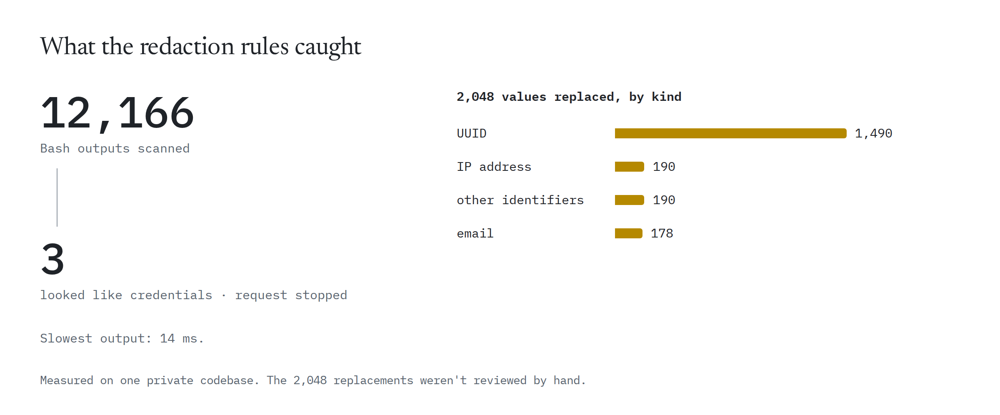
</picture>

More detail: [what leaves your machine](docs/privacy.md).

## The rules

1. **No proof, no "done".** Test output counts as proof; a sentence saying the tests pass doesn't.
2. **Silence is the default.** A check that finds nothing adds nothing to Claude's context.
3. **Code first, then a model.** If plain code can answer, no model is asked.
4. **Count the turns, not the calls.** An extra Claude turn costs far more than a Jev call.
5. **Ask better, not again.** Add the missing fact instead of repeating the question.
6. **Send the minimum.** Only what a check needs leaves your machine.
7. **Receipts, or it didn't happen.** Every call is logged, and no saving is claimed without a measurement.
8. **The referee can be overruled.** You and Claude keep the final say.

The reasoning behind each one is in [MANIFESTO.md](MANIFESTO.md) ([Türkçe](MANIFESTO.tr.md)).

## Learn more

- [Configuration](docs/configuration.md): settings, the project file, packs and the key lookup order
- [What leaves your machine](docs/privacy.md) and [Economics](docs/economics.md)
- [Measurements](docs/measurements.md): every number above, with its method and limits
- [A recipe for the project `verify` skill](docs/verify-skill.md): run `done` on your test output before every commit
- [FAQ](docs/faq.md), [Roadmap](ROADMAP.md) and [Changelog](CHANGELOG.md)
- [Contributing](CONTRIBUTING.md): no API key needed, tests run offline. Security reports: [SECURITY.md](SECURITY.md)
- Writing your own TypeSafe code? TypeSafe's official plugin gives Claude the full API context: `claude plugin marketplace add typesafe-ai/skills`, then `claude plugin install typesafe@typesafe-ai`. claude-referee doesn't need it.

---

<sub>claude-referee is an independent, unofficial project, not affiliated with or endorsed by Anthropic or TypeSafe. It fails open, it can be switched off, and it is not a security boundary. MIT licensed. "Claude" and "Claude Code" are trademarks of Anthropic, PBC; "TypeSafe" and "Jev" are trademarks of their owner, used here only to say what claude-referee works with.</sub>
